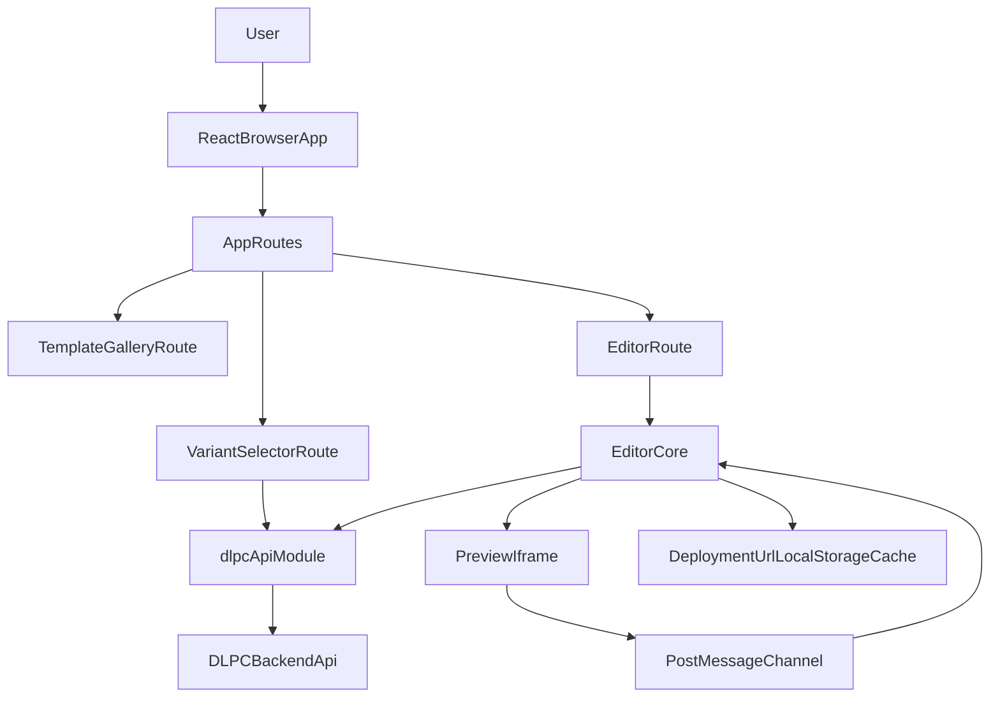

# Architecture

## Purpose

This document explains the system architecture for the Landing Creator App frontend and how it coordinates with the DLPC backend.

## High-Level Architecture

## Runtime Entry Points

- `src/main.jsx`: mounts React root and `BrowserRouter`.
- `src/App.jsx`: defines route-level composition.
- `src/features/landing-page-creator/Editor.jsx`: primary state machine for init/deploy/edit/settings flows.

## Route-Level Composition

- `/` -> `TemplateGallery` with template cards from `constants.templates`.
- `/template-variants` -> `VariantSelector` for variant discovery and selection.
- `/editor` -> `EditorRoute` resolves template from navigation state/query and renders `Editor`.

`EditorRoute` guards invalid direct access by redirecting to `/` when a template cannot be resolved.

## Feature Module Map

- `TemplateGallery.jsx`: selects template and navigates to variant step.
- `VariantSelector.jsx`: pulls variant configs and performs initial init/deploy workflow.
- `Editor.jsx`: orchestrates deployment lifecycle and editing UX.
- `dlpcApi.js`: centralizes backend HTTP calls and polling helpers.
- `LeftPanel.jsx`: composes control UI (info bar, message log, settings, config, prompt).
- `PreviewPane.jsx`: iframe preview and load masking.
- `usePostMessage.js`: receives `TEMPLATE_READY` and `ELEMENT_CLICKED`.
- `useDeploymentPoller.js`: promise-based wait/notify for iframe readiness.
- `editorStorage.js`: localStorage cache for deployment URLs.

## State and Control Ownership

`Editor` owns:

- initialization state (`initStatus`, `initError`, `initStatusMessages`)
- deployment tracking (`deploymentUrl`, `currentDeploymentId`, `iframeRefreshNonce`)
- editing state (`messages`, `editStatus`)
- UI state (`activeField`, `settingsOpen`, `settingsSaving`, `domainSaving`)
- config state (`config`, `envSettings`, `customDomain`)

Child components are mostly controlled/presentational and mutate state through callbacks passed from `Editor`.

## Data Boundaries

- **Frontend route and UI state:** React state/hooks only.
- **Backend operations:** `dlpcApi.js` (`fetch` wrappers + normalization helpers).
- **Preview synchronization:** `window.postMessage` and iframe load events.
- **Persistence across sessions:** cached deployment URL in localStorage per user/template/site key.

## Known Architectural Constraints

- API base URL is hardcoded to stage in `dlpcApi.js` (not env-driven).
- User identity is currently fixed to `TEMP_USER_ID = "21"` in feature flows.
- `dev:server` script exists, but no `server/` implementation is present in repo.
- No explicit global state library; complex editor lifecycle is handled in a single component (`Editor.jsx`).
