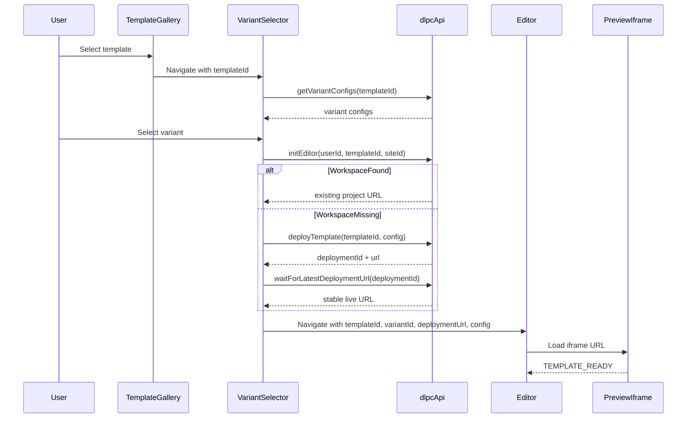

# Landing Page Creator Flow

## Purpose

This document describes the end-to-end feature flow from template selection to live deployment updates.

## End-to-End Sequence

## Step 1: Template Selection

- `TemplateGallery` renders templates from `constants.templates`.
- Clicking a card navigates to `/template-variants` with `state.templateId`.
- Missing image fallback uses `/vite.svg`.

## Step 2: Variant Discovery

- `VariantSelector` resolves `templateId` from route state or query params.
- It calls `useVariantConfigs(templateId)` to fetch config variants.
- Missing or invalid `templateId` redirects to `/`.

## Step 3: Variant Initialization + Deployment

When user selects a variant (`handleSelect`):

1. Create `variantId` with fallback strategy (`variantId`, `id`, `name`, `slug`, synthetic index).
2. Call `initEditor({ userId, templateId, siteId: variantId })`.
3. If workspace is not found, call `deployTemplate(...)`.
4. If deployment id exists, poll using `waitForLatestDeploymentUrl(...)`.
5. Cache resulting URL in localStorage (`editorStorage.writeCachedDeploymentUrl`).
6. Navigate to `/editor` with selected context.

## Step 4: Editor Initialization

`Editor` initializes in two modes:

- **Preloaded mode:** route state already includes deployment URL (from variant selection).
- **Cold mode:** calls `initEditor`, may deploy default config, and falls back to template preview/cached URL while preparing.

State resets are intentional at flow boundaries to avoid stale messages or stale deployment metadata.

## Step 5: Preview Sync and Inline Config Editing

- Iframe preview is rendered by `PreviewPane`.
- `usePostMessage` listens for:
  - `TEMPLATE_READY`: marks iframe ready.
  - `ELEMENT_CLICKED`: opens `ConfigPanel` for clicked field.
- On config state changes, editor posts `CONFIG_UPDATE` to iframe content window.

## Step 6: AI Edit Flow

When prompt is submitted:

1. Add user + system messages to session log.
2. Call `editTemplate(...)`.
3. If `deploymentId` exists, poll for latest URL.
4. Refresh iframe URL and run retry loop waiting for `TEMPLATE_READY`.
5. Persist final URL and mark status as live.

Retry logic exists because deployment URL may be available before the page is frameable.

## Step 7: Manual Config Deploy Flow

- Deploy button triggers `deployTemplate(...)` with current config state.
- If `deploymentId` exists, poll until stable URL.
- Refresh preview and persist URL in cache.

## Step 8: Settings and Domain Flow

From settings panel in `LeftPanel`:

- Environment flags save via `upsertDlpcProjectEnv(...)`, then optional redeploy polling.
- Custom domain save via `addDlpcCustomDomain(...)`.
- On domain success, UI message includes DNS steps for cPanel + Vercel verification.

## Error Handling Model

- API helpers throw on non-OK responses with best-effort message extraction.
- UI catches errors per operation and pushes error messages into session timeline.
- Initialization failure sets `initStatus = "error"` and displays top-panel error block.
